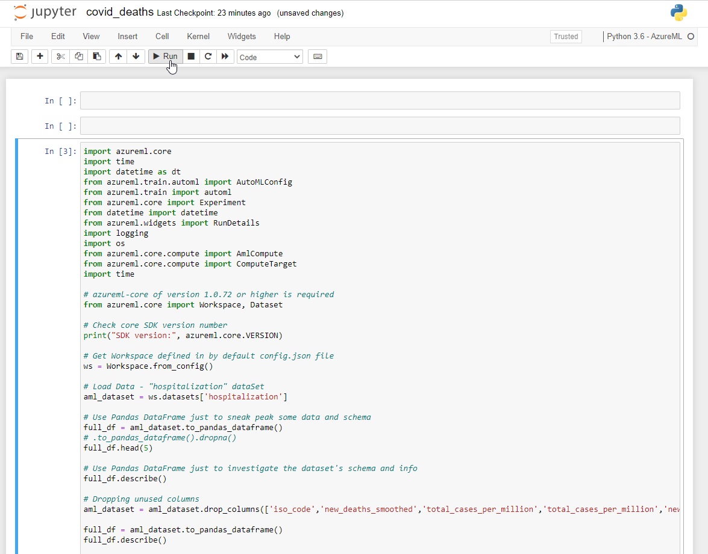

# AI_Azure_AML
The project contains .csv file with covid data and Notebook (covid_deaths.ipynb) file, where are defined instructions to execute e.g. in Jupyter.

Azure Machine Learning service used to calculate a model to predict new_deaths based on historical covid data. 
Model type set to **regression**.

How to run the Notebook (step-by-step):

1.Before code running, there have to add covid-data.csv as DataSet to Azure Machine Learning. 
 

DataSet is named 'hospitalization'. If call data in the other name **you have to rename dataSet** in the Notebook script too.

2.Create new Compute Instance

3.Open a Jupyter - just click Jupyter (link) below Application URi label in Compute Instance box.

4.Upload Notebook to Jupyter.

5.Open and execute the Notebook

In covid_deaths.ipynb are a lot of comments which describe specified instructions. 

